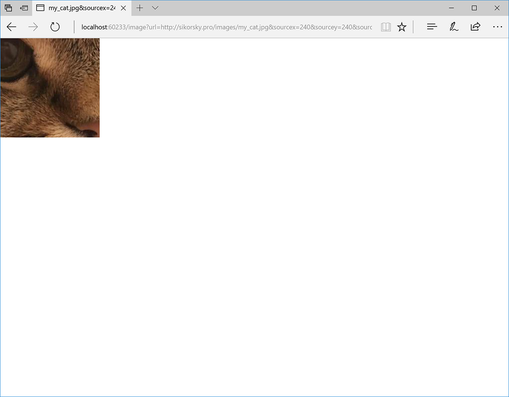

# ASP.NET Core Sample Image Resizing Service
This is a demo web application for the
“[ASP.NET Core Sample Image Resizing Service](https://medium.com/@dmitry.a.sikorsky/asp-net-core-sample-image-resizing-service-538a7dfb2c15)”
post on the [Dmitry Sikorsky’s blog](https://medium.com/@dmitry.a.sikorsky).
It demonstrates how to build image resizing service on ASP.NET Core using the
CoreCompat.System.Drawing package for the image processing.

It downloads an image specified by the URL, crops it using the parameters (provided in the URL too),
and writes the cropped image into the output stream.

This is the original photo of my cat:

*Original photo of my cat*

This is the URL used to crop the photo:
http://localhost:60233/image?url=http://sikorsky.pro/images/my_cat.jpg&sourcex=240&sourcey=240&sourcewidth=360&sourceheight=360&destinationwidth=200&destinationheight=200

And this is the cropped photo:

*Cropped photo of my cat*

Usually I use something like this to prepare images for the mobile devices
depending on their real screen resolutions and image container sizes. This allows to save the traffic and
image downloading time. Also, it makes images look better because they don’t need any scaling.

Updated to use .NET Core 3.1.

## Using the Application

1. Run the application.
2. You will have 404 error and it is OK.
3. Navigate to http://localhost:60233/image?url=http://some-image-url&sourcex=0&sourcey=0&sourcewidth=100&sourceheight=100&destinationwidth=100&destinationheight=100.
4. You will get 100x100 fragment from the given image.